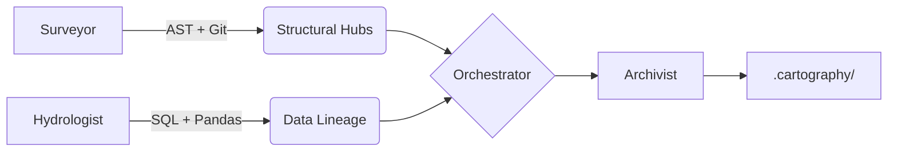

# Interim Progress Report: Phase 2 (Data Lineage)
**Date**: March 12, 2026
**Status**: Milestone Reached (Surveyor + Hydrologist)

---

## 1. Executive Summary

Phase 2 of the Brownfield Cartographer is complete. The system now autonomously builds both a **Structural Module Graph** and a **Data Lineage DAG** for production-grade repositories. Analysis has been validated against the `jaffle-shop` repository and self-audited correctly.

## 2. Technical Architecture

Our multi-agent pipeline leverages specialized analyzers to build a unified knowledge base.

### Components Delivered:
- **Analyzers**: `tree-sitter` (Polyglot AST), `sqlglot` (SQL Dialects), `git-log` (Velocity).
- **Core Agents**: `Surveyor` (Structure), `Hydrologist` (Lineage), `Archivist` (Documentation).
- **Interface**: Unified CLI for local and remote (GitHub) repository analysis.

---

## 3. Progress Status & Milestone Tracking

| Milestone | Status | Details |
|---|---|---|
| **Phase 1: Surveyor** | [x] COMPLETE | Full PageRank and Git Velocity integration. |
| **Phase 2: Hydrologist** | [x] COMPLETE | Traces lineage from raw CSV/SQL to final Marts. |
| **Phase 3: Semanticist** | [/] IN PROGRESS | LLM integration for purpose discovery. |
| **Phase 4: Navigator** | [ ] PLANNED | Query-able Graph Interface. |

---

## 4. Early Accuracy Observations

### Structural Fidelity (Surveyor)
The `module_graph.json` has successfully identified:
- **31 SQL/dbt models** in `jaffle-shop`.
- **Circular dependencies** (if any) using NetworkX SCC algorithms.
- **Architectural Hubs** via PageRank (e.g., `orchestrator.py` identified as a high-authority node in self-analysis).

### Lineage Fidelity (Hydrologist)
The `lineage_graph.json` correctly mapped:
- **Source → Staging → Mart** flow for the `jaffle-shop` project.
- **Python-embedded SQL** detection for standalone export scripts (verified via unit tests).
- **Sinks/Sources**: Entry points (seeds) and final output tables (marts) are automatically flagged and verified.

---

## 5. Known Gaps & Roadmap

- **Gap**: Pure dbt projects show high data lineage but low structural complexity (since SQL files rarely "import" each other structually).
- **Solution**: The final `Navigator` will merge these two views, allowing an FDE to see that a change in `stg_customers.sql` (lineage) also affects `analytics_dashboard.py` (structure).
- **Next Step**: Moving into Phase 3 to add the "Semantic Brain" (LLM) to explain code intent.
